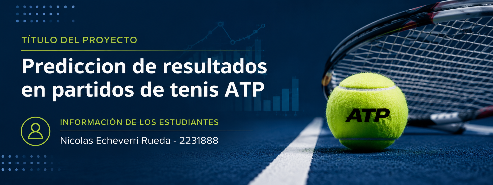

# Predicción de Resultados de Partidos de Tenis ATP (2000-2026)

 

**Autor:** Nicolas Echeverri Rueda

**Objetivo:** Predecir los resultados de enfrentamientos de tenis utilizando algoritmos de aprendizaje automático sobre datos históricos de la ATP.

**Dataset:** Datos históricos de la ATP (2000-2026) con estadísticas de jugadores y partidos - https://www.kaggle.com/datasets/dissfya/atp-tennis-2000-2023daily-pull

**Modelos:** Decision tree, Random Forest, SVM, Naive Bayes, Redes Neuronales, PCA, t-SNE

**Enlaces:**
* **Código:** https://drive.google.com/file/d/1YzewGe_jER189N39oDCUD9FmQ1f65HKB/view?usp=sharing
* **Video:** https://youtu.be/LbpwO0RO4Bo
* **Repositorio:** https://github.com/EcheverriNicolas/ia1-proyecto-final/tree/main
